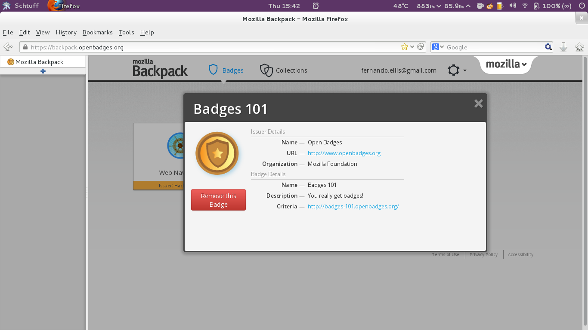

:title: XO Laptop Lemonade Stand slides re-structured-text
:author: Fernando Ellis, Ian Furry, Ryan Stush, David Wilson
:description: Flock presentation slides
:keywords: presentation, XO Badges, Lemonade, impress.js
:css: flock-slides.css
:skip-help: true
:data-transition-duration: 500

----

Mozilla Open Badges and XO Laptops
===================================

Fernando Ellis, Ian Furry, Ryan Stush, David Wilson
FOSS@RIT SURF

----

:data-x: r1200

Outline
=========

- Mission Statement
    - OLPC
        - Deployments
    - Badges
        - Mozilla Open Badges
            - HASTAC
            - MacArthur Foundation
            - Anatomy of a badge
            - Backpack
    - Activities
        - Lemonade Stand
        - Sash
    - Challenges/Limitations
        - Datastore
        - School server
    - Localization
        - Gettext
        - Stand customization (ice cream, etc..)
    - Next Time...
        - Stable school server
        - Pushing badges to backpack
        - Additional challenges and badges
- Acknowledgements

----

:data-y: r-1200

Summer Undergraduate Research Fellowship
========================================
A program funded by the newly rennovated MAGIC Center at RIT.

Proposal:
.........
1. To implement Mozilla Open Badges onto the OLPC XO Laptop

2. To make implementation simple and easy for future users

3. To explore the benefits of gamification in education

----

:data-x: r-1200

FOSSRIT
========
An applied research facility dedicated to free and open source software and open web technologies.
By providing students with a cooperative work experience, FOSSRIT educates and encourages
aspiring developers to grow as contributors and a positive force in the world.
FOSSRIT_

.. image:: images/logo.png

.. _FOSSRIT: http://foss.rit.edu/

----

:data-x: r-1200

SugarLabs
=========
Sugarlabs is the company responsible for developing the Sugar Learning Platform which powers the OLPC XO laptop.
SugarLabs_

Sugar:
.........
The Sugar Learning Platform is a free and open-source software focused on youth education.

.. _SugarLabs: http://wiki.sugarlabs.org/go/Welcome_to_the_Sugar_Labs_wiki

----

:data-y: r1200

One Laptop Per Child
====================
Mission:
..............
To provide each child with a rugged, low-cost, low-power, connected laptop.

UN Support:
^^^^^^^^^^^^^^
In January 2008, the UN Development Programme partnered with OLPC to deliver XO's and learning resources to schools in the world's least developed countries.
OLPC_

.. image:: images/OLPC.png
   :width: 764px
   :height: 262px

.. _OLPC: http://en,wikipeida.org/wiki/One_Laptop_per_Child

----

:data-y: r1200

Distribution:
=============
OLPC XO latops are distributed in two distinct ways.

#. Deployments: Ordered by governments or schools

#. Give One Get One Program: Public Support

Currently, OLPC doesn't directly sell XO laptops to users but are known to hold fundraisers where they may be purchsed.

OLPC XO's have been deployed in many countires around the globe including:
Peru, Uruguay, Haiti, Ghana, Rwanda, Etheopia, India, Mongolia, and many others.

.. image:: images/OLPCMAP.png
   :width: 900px
   :height: 400px

----

:data-x: r1200

Mission Statement
==================

- To connect the Mozilla open badges infrastructure to XO Laptops to supply all children using the laptop with access to the skills and learning recognition provided by the program.

----

:data-x: r1200

Mozilla Open Badges
======================

- Badges are a digital representation of skills learned outside the classroom

- Four examples of emerging learners that could benefit from badges

    - Kareem the High school student who applies himself to extracurriculars instead of rigid school system

    - Sarah the freelance programmer who has been coding since middle school and now feels a college degree has nothing more to offer her

    - Jin the aspiring artist who has grown a stable following within her community but wishes to move to a new city

    - Antony the middle aged worker who has to find a new job in a field that has greatly changed from when he entered it

- Juan Carlos the peruvian student who has been given an XO Laptop from his school in his village in the mountains and aspires to learn and share all technology has to offer

----

:data-x: r1200

HASTAC & MacArthur Foundation
==============================

- Founding Partners of Mozilla Open Badges

- Both work towards increasing technological literacy in a digital age

    - MacArthur-Foundation_ believes educational equality to be a human right

    - HASTAC_ bridging the disconnect between technology and the humanities

.. _MacArthur-Foundation: http://www.macfound.org/about/

.. _HASTAC: http://www.hastac.org/about

- Differences:
    
    - MacArthur Foundation is an international foundation that raises money to invest in programs for human rights, international justice, peace and security, etc.

    - HASTAC is essentially an open-sourced attempt at having the people of all backgounds work together to supplement education with technology or search for ways to interconnect the two

----

:data-y: r-1200

Anatomy of a Badge 
====================

- Badges are stored on one's backpack at backpack.openbadges.org

- Issuer Details
    
    - Name

    - URL

    - Organization

- Badge Details

    - Name

    - Description

    - Criteria

----

:data-y: r-1200

----

:data-y: r-1200

School servers
=================

Potential Benefits
...

    - Teachers could create badges easily accessed by all children in the school
    - Would an ideal world have internet everywhere?

    - Effecient means of uploading/downloading badges

Difficulties
...

    - Not all XO deployments have internet

    - RIT's automatic de-authentication

    - Most recent release wasn't stable

    - install file configurations

----

:data-x: r-1200

Playtesting
=============

First we playtested Lemonade Stand to see what it was like.
Then we had children who fit the age group it was designed
for test it at different events we participated in.

We discoverd that some parts of the game were hard to underdatnd
and that some of games freatures where a bit too easy.

----

:data-x: r-1200

A New UI
==========

#. Old interface was too clunky

#. Poor readability and usability

----

:data-x: r-1200

.. image:: images/old-ui.png
    :width: 600px
    :height: 375px

.. image:: images/new-ui.png
    :width: 600px
    :height: 375px

----

:data-x: r-1200

.. image:: images/new-ui-profit.png
    :width: 800px
    :height: 600px

----

:data-y: r1200

New Selections
=================

#. Language selection

#. Menu screen

#. Difficulty selection

----

:data-y: r1200

.. image:: images/new-ui-selection.png
    :width: 800px
    :height: 600px

----

:data-y: r1200

Balancing problems
=====================

When we first started working with Lemonade Stand the game was too easy.

- Players could gain money way too fast.
- When players had lots of items events did nothing.

While we were changing Lemonade Stand  we often made the game too hard and
had to tone down the difficulty.

- ingredients cost more then selling price
- negative events could blitz the player into being stuck.

----

:data-y: r1200

----

:data-x: r1200

Balancing Fixes
==================

Balancing was a tricky dance.
We had to offer the player a challenge without being overwheliming.

To balance the game we gave everything numerical values.
Then created equations for each element being balance.
Results equaled planed scaled value based on dificulty selection.

----

:data-x: r1200

Reworking Random Events
==========================

Originally
..........
- All the events were in one array and chosen with a random number generator
- If random number went beyond array then there was no event.
- Events only had static effects.

Now
.........
- Events seperated into two Arrays, one for positve events and one for negative.
- Events chosen with a weighted system that adjusts to difficulty
- Some of the rare events scale effect to progress of the player.

----

:data-x: r1200

Sash
========

#. Activity for displaying the user's badges

#. Reads datastore object for badge information

#. Generates a badge from information received from DS object

#. Displays badge(s) onto the window

#. Tooltips provide useful information about the badges

----

:data-x: r1200

.. image:: images/sash-ui.png
    :width: 800px
    :height: 600px

----

:data-x: r1200

How does Sash work?
=======================

#. Activities that award badges use a badges library
#. Badges lib creates a DS object with a specific property: has_badges
#. Sash finds any DS object that has property 'has_badges: True'
#. Sash checks if that activity has awarded the user any badges
#. If so, Sash reads a symbolic link of the badge images that the badges lib created
#. Badges are then displayed in Sash with tooltip information such as the name, criteria, data acquired, etc.

----

:data-y: r-1200

Customization
=================

#. Don't like running a lemonade stand but wish you could make your own? ok, that's a thing.
#. Ability to create other types of stands. ex: Ice Cream Stand!
#. Users are able to load in their own sets of images to generate that new stand

----

:data-y: r-1200

.. image:: images/icecream-shop.png
    :width: 600px
    :height: 375px

----

:data-y: r-1200

Ingredients
===============

When we were creating different versions of stands it some the other stands seemed
like it would be more fun if there was wider verity of ingredients to use.

This required the way ingredients are called to be made more flexable.

----

:data-y: r-1200

Recipes
============

With more ingredients the ability to choose between multiple recipes
and for the player to be able to make their own became obvious. 

However since we haven't designed a good way to graphically choose
recipes, the code is in the game but currently unused.

----

:data-y: r-1200

Localization
================

#. Created a Spanish translation for the game
#. Able to efficently generate any translation and get it working on the XO
#. Other project SkyTime has English, Spanish, and French.
#. Used gettext for translations

----

:data-x: r-1200

How to get translations to work
=================================

.. code:: python

    # $python setup.py genpot
    # Generates a po/ directory with <bundle_name>.pot file 
    # (rename to <bundle_name.po>)
    # Edit the .po file and add your translations
    # $python setup.py dist_xo
    # Generates the locale/ directory where it stores the new .mo file
    # Add these next two lines of code at the beginning of the program
     import gettext
     lang = gettext.translation(<bundle_id>, 'locale/', languages=[<name_of_mo_file>])
     _ = lang.ugettext
    # Every word you want translated, change it to _(<string>)

----

:data-x: r-1200

Acknowledgements
===================

- SURF at RIT
- FOSS@RIT
- Remy Decausemaker
- Professor Stephen Jacobs
- Ronald McNair Program

----

:data-x: r-1200

Questions?
==============

